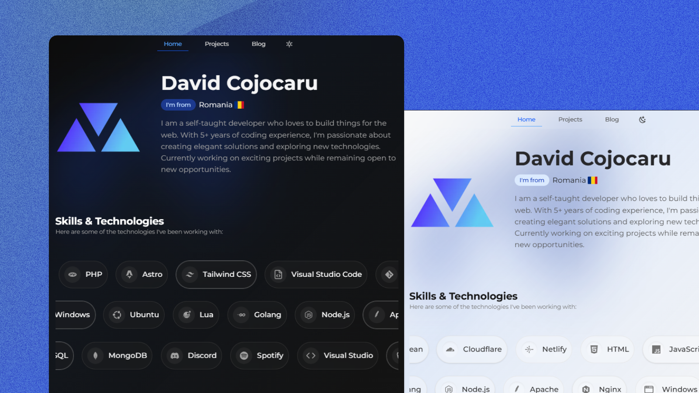

# cojocarudavid.me


👋 Hi, I'm **David**, a 17-year-old coder from Romania. 🚀 Passionate about web development with **JavaScript, PHP, and React**. Linux enthusiast automating tasks with Bash.

---

## 🚀 Project Overview

**cojocarudavid.me** is my **personal portfolio website**, built with **Astro.js** and styled using **Tailwind CSS**. It serves as a hub for my projects, blog posts, and personal updates.



---

## 🌟 Features

✅ **Blazing fast** - Optimized for performance and SEO.  
🎨 **Modern & responsive** - Tailwind CSS for easy customization.  
🔒 **Secure & reliable** - Follows best security practices.  
📱 **Mobile-friendly** - Fully responsive across devices.  
📝 **Blog support** - Share insights and experiences.

---

## 🛠️ Tech Stack

- **[Astro.js](https://astro.build/)** - Static site generator.
- **[React.js](https://reactjs.org/)** - Used for components.
- **[Tailwind CSS](https://tailwindcss.com/)** - Utility-first CSS framework.
- **[TypeScript](https://www.typescriptlang.org/)** - Typed JavaScript at scale.
- **[JavaScript](https://developer.mozilla.org/en-US/docs/Web/JavaScript)** - Core language.
- **[CSS](https://developer.mozilla.org/en-US/docs/Web/CSS)** - Styles and layouts.

---

## 📚 Setup & Installation

### Prerequisites

Ensure you have the following installed:

- [Node.js](https://nodejs.org/) and npm.
- [Git](https://git-scm.com/).

### Installation Steps

1. **Clone the repository:**

   ```sh
   git clone https://github.com/cojocaru-david/cojocarudavid.me.git
   ```

2. **Navigate to the project directory:**

   ```sh
   cd cojocarudavid.me
   ```

3. **Install dependencies:**

   ```sh
   npm install
   ```

4. **Run the development server:**
   ```sh
   npm run dev
   ```

---

## 🎯 Usage

### Development Mode

Run the local development server:

```sh
npm run dev
```

### Production Build

Generate a production-ready build:

```sh
npm run build
```

---

## 🤝 Contributing

Contributions are welcome! Please follow the [contributing guidelines](CONTRIBUTING.md) before submitting changes.

---

## 📄 License

This project is licensed under the **MIT License** - see the [LICENSE](LICENSE) file for details.

---

## 💬 Contact

📧 Email: [contact@cojocarudavid.me](mailto:contact@cojocarudavid.me)

### 🌐 Connect with Me

- [LinkedIn](https://www.linkedin.com/in/cojocaru-david)
- [Blog](https://cojocarudavid.me/blog)

---

## ⭐ Show Your Support

If you like this project, give it a ⭐ on GitHub!

---

## 🙏 Acknowledgments

- [Astro.js](https://astro.build/)
- [Tailwind CSS](https://tailwindcss.com/)
